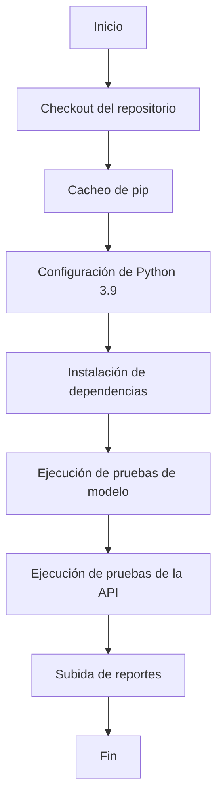

# Proyecto Notebook
[](https://github.com/ElCuboNegro/latam_ml_challenge/actions/workflows/ci.yml)
## Tabla de Contenidos

1. [Introducción](#introducción)
2. [Arquitectura](#arquitectura)
3. [Depuración](#depuración)
4. [Modelo](#modelo)
   - [Reentrenamiento de Modelos](#reentrenamiento-de-modelos)
   - [Análisis de Resultados](#análisis-de-resultados)
   - [Clasificación y Optimización](#clasificación-y-optimizaci%C3%B3n)
5. [API](#api)
6. [Despliegue](#despliegue)
   - [Pipeline de Integración Continua (CI)](#pipeline-de-integraci%C3%B3n-continua-ci)
     - [Activación del Workflow](#activaci%C3%B3n-del-workflow)
     - [Pasos del Pipeline de CI](#pasos-del-pipeline-de-ci)
     - [Diagrama del Pipeline de CI](#diagrama-del-pipeline-de-ci)
   - [Pipeline de Despliegue Continuo (CD)](#pipeline-de-despliegue-continuo-cd)
     - [Activación del Workflow](#activaci%C3%B3n-del-workflow-1)
     - [Pasos Comunes en CD](#pasos-comunes-en-cd)
     - [Pasos Específicos para Pull Requests](#pasos-espec%C3%ADficos-para-pull-requests)
     - [Pasos Específicos para Producción](#pasos-espec%C3%ADficos-para-producci%C3%B3n)
     - [Diagrama del Pipeline de CD](#diagrama-del-pipeline-de-cd)
   - [Dockerfile y Decisiones de Diseño](#dockerfile-y-decisiones-de-dise%C3%B1o)
7. [Conclusión](#conclusi%C3%B3n)

---

## Introducción

Este documento detalla el diseño y desarrollo de un proyecto centrado en la predicción de retrasos en vuelos utilizando modelos de machine learning. Se cubren aspectos desde la arquitectura del proyecto, la depuración, el desarrollo del modelo, la implementación de una API y los pipelines de Integración Continua (CI) y Despliegue Continuo (CD).

---

## Arquitectura

La arquitectura del proyecto presenta áreas que no se adhieren completamente a los principios SOLID. Específicamente, el método `model.preprocess` viola el principio de responsabilidad única al manejar dos tipos de datos distintos:

- **Limpieza del dataset**: Preprocesamiento de datos para entrenamiento.
- **Entrada de datos para predicción**: Transformación de nuevos datos para predicciones.

Se recomienda separar estas funcionalidades en métodos o clases independientes para mejorar la mantenibilidad y claridad del código.

---

## Depuración

### Endpoints y Pruebas

- **Endpoint para Ajuste de Hiperparámetros**:
  - Implementación de `/tune` para ajustar hiperparámetros del modelo XGBoost en tiempo de ejecución.

- **Pruebas de Consistencia del Preprocesamiento**:
  - Creación de pruebas en `tests/model/test_model.py` para asegurar que el dataframe preprocesado mantiene la consistencia con los datos originales durante el desarrollo del preprocesamiento.

---

## Modelo

### Reentrenamiento de Modelos

Se han entrenado dos modelos principales con técnicas de balanceo de clases:

#### XGBoost con Balanceo

| Clase | Precisión | Recall | F1-Score | Soporte |
|-------|-----------|--------|----------|---------|
| 0     | 0.88      | 0.53   | 0.66     | 11,103  |
| 1     | 0.25      | 0.67   | 0.36     | 2,539   |

| Métrica                        | Valor |
|--------------------------------|-------|
| Exactitud                      | 0.56  |
| Promedio Macro (Precisión)     | 0.56  |
| Promedio Macro (Recall)        | 0.60  |
| Promedio Macro (F1-Score)      | 0.51  |
| Promedio Ponderado (Precisión) | 0.76  |
| Promedio Ponderado (Recall)    | 0.56  |
| Promedio Ponderado (F1-Score)  | 0.61  |
| Soporte Total                  | 13,642|

#### Regresión Logística con Balanceo

| Clase | Precisión | Recall | F1-Score | Soporte |
|-------|-----------|--------|----------|---------|
| 0     | 0.87      | 0.52   | 0.65     | 11,103  |
| 1     | 0.24      | 0.67   | 0.36     | 2,539   |

| Métrica                        | Valor |
|--------------------------------|-------|
| Exactitud                      | 0.55  |
| Promedio Macro (Precisión)     | 0.56  |
| Promedio Macro (Recall)        | 0.60  |
| Promedio Macro (F1-Score)      | 0.50  |
| Promedio Ponderado (Precisión) | 0.76  |
| Promedio Ponderado (Recall)    | 0.55  |
| Promedio Ponderado (F1-Score)  | 0.60  |
| Soporte Total                  | 13,642|

### Análisis de Resultados

- **Precisión clase 1 (retrasos)**: ~0.25 en ambos modelos, indicando baja precisión al predecir retrasos.
- **Recall clase 1 (retrasos)**: 0.67, capturando el 67% de los retrasos reales.
- **F1-Score clase 1**: 0.36, reflejando un equilibrio bajo entre precisión y recall.

Los modelos presentan desafíos en precisión para la clase minoritaria, lo que podría implicar muchos falsos positivos.

### Clasificación y Optimización

- **Optimización de Hiperparámetros**:
  - Uso de `model.tune_hyperparameters` para encontrar los mejores parámetros del modelo XGBoost.
  - **Mejores parámetros**:
    ```python
    {
        'colsample_bytree': 0.6,
        'learning_rate': 0.01,
        'max_depth': 2,
        'n_estimators': 500,
        'subsample': 0.5
    }
    ```
  - **Mejor F1-Score clase 0**: 0.8977

- **Corrección de Pruebas Unitarias**:
  - Ajuste de un test que incorrectamente evaluaba que el recall debía ser menor a 0.60.

---

## API

- **Validación de Datos con Pydantic**:
  - Implementación de validaciones robustas para asegurar la integridad de los datos de entrada.

- **Validación del Campo `OPERA`**:
  - Verificación de que los valores de `OPERA` coincidan con los utilizados en el entrenamiento, permitiendo valores válidos aunque no estén en los features utilizados.

---

## Despliegue

### Pipeline de Integración Continua (CI)

#### Activación del Workflow

- Se activa en cada push a:
  - `main`
  - `develop`
  - Ramas `feature/*`

#### Pasos del Pipeline de CI

1. **Checkout del repositorio**
2. **Cacheo de dependencias de pip**
3. **Configuración de Python 3.9**
4. **Instalación de dependencias de pruebas**
5. **Ejecución de pruebas de modelo**
6. **Ejecución de pruebas de la API**
7. **Subida de reportes de pruebas**

#### Diagrama del Pipeline de CI



### Pipeline de Despliegue Continuo (CD)

#### Activación del Workflow

- **CD para PRs**: Al crear o actualizar una Pull Request hacia `main`.

#### Pasos Comunes en CD

1. **Checkout del repositorio**
2. **Configuración del SDK de Google Cloud**
3. **Configuración de Docker para Artifact Registry**
4. **Construcción y Push de la imagen Docker**

#### Pasos Específicos para Pull Requests

1. **Despliegue en Cloud Run (Pruebas)**
2. **Obtención de la URL del servicio**
3. **Instalación de dependencias para pruebas de estrés**
4. **Ejecución de pruebas de estrés**
5. **Destrucción del servicio de prueba**
6. **Subida de reportes de estrés**

#### Pasos Específicos para Producción

- **Despliegue en Cloud Run (Producción)**

#### Diagrama del Pipeline de CD

```mermaid
flowchart TD
A[Inicio] --> B[Checkout del repositorio]
B --> C[Configuración del SDK de Google Cloud]
C --> D[Configuración de Docker para Artifact Registry]
D --> E[Construcción y Push de la imagen Docker]
E --> F{Es PR?}
F -->|Sí| G[Despliegue en Cloud Run (Pruebas)]
G --> H[Obtención de la URL]
H --> I[Instalación de dependencias para estrés]
I --> J[Ejecución de pruebas de estrés]
J --> K[Destrucción del servicio]
K --> L[Subida de reportes]
L --> M[Fin]
F -->|No| N[Despliegue en Cloud Run (Producción)]
N --> M
```

### Dockerfile y Decisiones de Diseño

- **Imagen Base Slim**:
  - Uso de `python:3.11-slim` para reducir el tamaño de la imagen.

- **Instalación de Dependencias Esenciales**:
  - Paquetes como `build-essential`, `gcc`, `python3-dev`, `libpq-dev`.

- **Instalación Anticipada de NumPy**:
  - Para evitar problemas con dependencias que requieren `numpy`.

- **Configuración del Entorno**:
  - Directorio de trabajo `/root`, copia de `/challenge`, `/tests`, `/data`.

- **Exposición de Puertos y Variables de Entorno**:
  - Puerto `8000`, variables para `uvicorn`.

- **Comando de Ejecución**:
  - Uso de `uvicorn` para iniciar la aplicación.

---

## Notas finales

- Los test no son suficientes para garantizar la calidad del modelo, se debe agregar mas casos que permitan evaluar las respuestas del modelo ante diferentes escenarios.
- El test de stress no es suficiente para garantizar que el modelo funcione correctamente bajo condiciones de alta carga.
- Es posible hacer deploy del modelo a GCP sin necesidad de usar github actions.
- La API tiene un error de diseño en el endpoint `/predict`, ya que la respuesta es posicional, al enviarse un request de muchos vuelos validos, si uno solo es invalido, el request falla con un error 400, y al esperar una respuesta

```json
{
	"predict": [
		0,
		1
	]
}
```

dicha respuesta va a ser unicamente posicional, lo que provoca que, en el momento de hacer un request de muchos datos validos con un dato invalido, no se pueda representar facilmente el error 400, ya que si no se representa, simplemente no se concatenaria el error, haciendo imposible identificar cual es el vuelo al que dicho error se le asocia.

para esto, propongo enviar junto a la prediccion, el id del vuelo, y asi poder identificar cual es el vuelo que esta provocando dicho error.

```json
{
	"predict": [
		<flight_id>:0,
		<flight_id>:1,
    <flight_id>:-1 -for 400-like-requests-
	]
}
```


---

*Documento postprocesado por ChatGPT o1-preview*